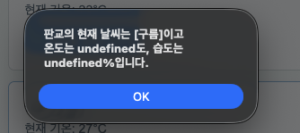

# 8월 25일 진행 실습

## 진행 과정

디자인을 위한 css와 각 섹션의 class는 생성형 ai를 통해 작성 <br>
섹션(기능 명시 힌트) 내부 및 JavaScript 부분을 비워두고 직접 코드 작성

## 추가 부분

- 습도를 데이터(weatherList)에 추가
- v-if, v-else-if로 더움, 선선함 이외에도 '온도가 25도 이상, 습도 60이상' 조건에 대해 "🫠 습하고 더움(25도 이상 습도 60 이상)" 출력 설정
- 습하고 더움에 대해 style.css내에 .temperature-label.humidhot를 추가
- 2번째 hands on 에서 도시 필터를 반응형 변수로 추가 온도와 습도 조건에 따라 도시를 필터일

## 발생 문제점

### showDetail을 아래와 같이 온도와 습도를 추가적으로 보여주도록 수정시 사진처럼 undefined로 표시되는 문제점이 있었음

```js
const showDetail = (cityName, status, temp, humidity) => {
  window.alert(`${cityName}의 현재 날씨는 [${status}]이고 온도는 ${temp}도, 습도는 ${humidity}%입니다.`)
}
```



문제 발생 원인: 버튼 클릭에서 @click.stop에서 전달되는 인자를 맞춰서 수정하지 않았었음

문제 해결 방법: @click.stop에서 각각의 인자가 아닌 도시 전체의 인자를 반환하도록 설정, 기존 예시로 주어진 showDetail보다 코드를 간결하게 변경

```html
<!-- 수정 전 -->
<button type="button" class="detail-button" @click.stop="showDetail(city.name, city.status)">상세보기</button>

<!-- 수정 후 -->
<button type="button" class="detail-button" @click.stop="showDetail(city)">상세보기</button>
```

```js
// 수정 전
const showDetail = (cityName, status, temp, humidity) => {
  window.alert(`${cityName}의 현재 날씨는 [${status}]이고 온도는 ${temp}도, 습도는 ${humidity}%입니다.`)
}

// 수정 후
const showDetail = (city) => {
  window.alert(`${city.name}의 현재 날씨는 [${city.status}]이고 온도는 ${city.temp}도, 습도는 ${city.humidity}%입니다.`)
}
```

### 도시 검색시 하단 바에 같이 표시되지 않던 문제점이 있었음

발생 문제 원인: selectedCity만을 이용해서 받음으로서 클릭 했을 경우만 하단바의 문구 변경
문제 해결 방법: searchedCity 또한 포함하여 검색 결과에 따라 변경되도록 설정

```html
// 수정 전
<div class="status-bar" aria-live="polite">
  <p v-if="selectedCity">{{ selectedCity }}이 선택되었습니다.</p>
  <p v-else>카드를 클릭하거나 검색해 보세요.</p>
</div>

// 수정 후
<div class="status-bar" aria-live="polite">
  <p v-if="selectedCity">{{ selectedCity }}이 선택되었습니다.</p>
  <p v-else-if="searchCity">{{ searchCity }}를 검색중입니다.</p>
  <p v-else>카드를 클릭하거나 검색해 보세요.</p>
</div>
```