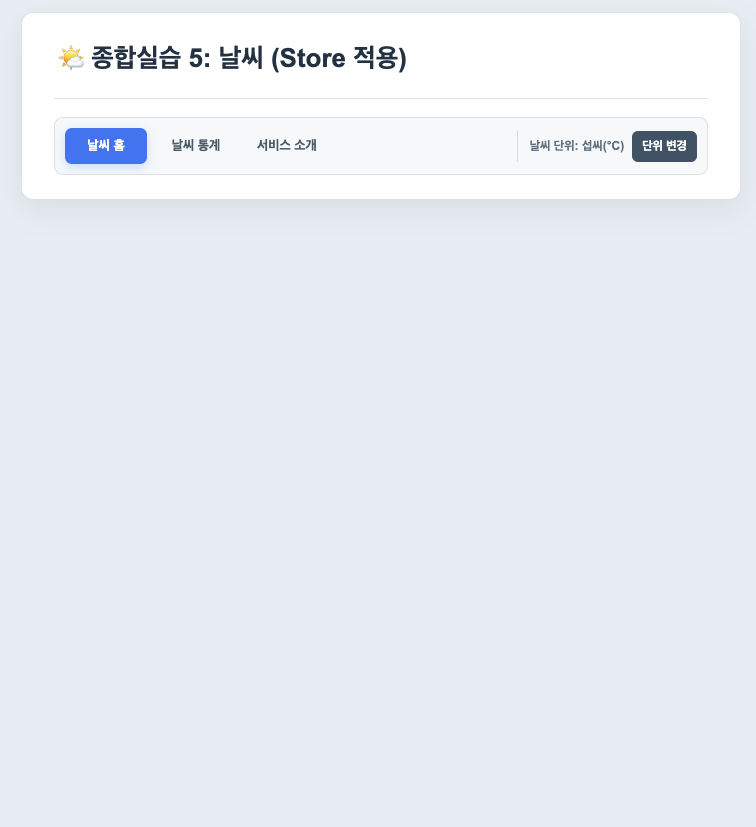
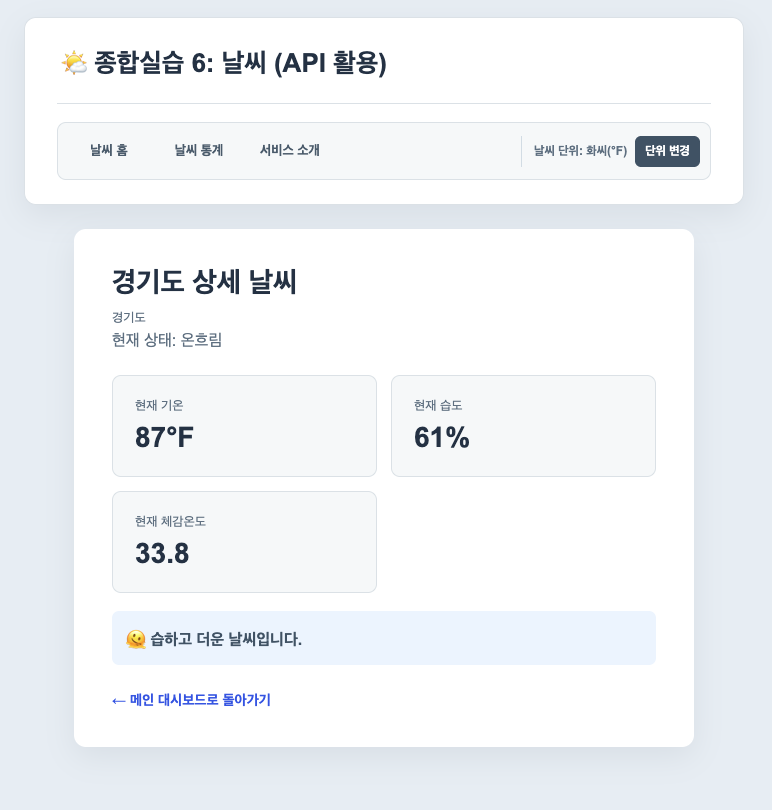

# 0824 ~ 0827 실습

## 추가된 부분들

### 0824, 0825
- 습도를 데이터(weatherList)에 추가
- v-if, v-else-if로 더움, 선선함 이외에도 '온도가 25도 이상, 습도 60이상' 조건에 대해 "🫠 습하고 더움(25도 이상 습도 60 이상)" 출력 설정
- 습하고 더움에 대해 style.css내에 .temperature-label.humidhot를 추가
- 2번째 hands on 에서 도시 필터를 반응형 변수로 추가 온도와 습도 조건에 따라 도시를 필터링(전체 도시, 더운 도시, 선선한 도시, 덥고 습한 도시)
- 필터링에 대해서도 이전 필터와 신규 적용 필터가 로그에 포함되도록 조치

### 0826
- 컴포넌트 분리 과정에서 하단 바 또한 추가적으로 분리 selectedCity, searchedCity, resultCount를 WeatherParent에서 주입 받아 사용
- 라우터를 적용 index.js를 통하여 기본 주소(localhost:----/)에는 home으로 라우팅, 이후 네비게이션, 상세보기 클릭에 따라 각 뷰로 라우팅
- 네비게이션 바와 제목이 합쳐진 블럭을 하나의 컴포넌트로 분리하여 App.vue에서 사용 라우팅 페이지 위에서 고정됨

### 0827(Store hands on)
- Pinia Store를 통해 화씨 - 섭씨 변환 기능을 추가
- 이전 weatherData를 여러 뷰에서 직접 임포트하여 사용하던 부분을 Store를 이용해서 관리하도록 변경 
- 날씨 통계(해당 날씨에 속하는 도시 수), Id로 도시 조회, 도시 목록을 Store 내에서 처리 후 각 뷰에서 사용

### 0827(API 추가)
- OpenWeather API에 추가적으로 통계지리정보시스템 SGIS API를 활용
- 이전 실습에 존재하던 도시들의 경우 기본값으로 보존
- SGIS API를 통해 사용자가 지역을 입력하면, API를 통해 해당 지역의 경도와 위도를 반환
- 경도와 위도 반환이 이루어지면 해당 지역을 새롭게 추가 날씨 상태는 ```미조회```로 표시
- ```전체 날씨 새로고침```버튼 클릭시 OpenWeather API를 통해 실제 조회 날씨로 업데이트
- API 상의 체감온도를 표시 정보에 추가

## 발생 에러 및 해결 과정

### showDetail을 온도와 습도를 추가적으로 보여주도록 수정시 사진처럼 undefined로 표시되는 문제(0825)

```js
const showDetail = (cityName, status, temp, humidity) => {
  window.alert(`${cityName}의 현재 날씨는 [${status}]이고 온도는 ${temp}도, 습도는 ${humidity}%입니다.`)
}
```


문제 발생 원인: 버튼 클릭에서 @click.stop에서 전달되는 인자를 맞춰서 수정하지 않았었음

문제 해결 방법: @click.stop에서 각각의 인자가 아닌 도시 전체의 인자를 반환하도록 설정, 기존 예시로 주어진 showDetail보다 코드를 간결하게 변경

```html
<!-- 수정 전 -->
<button type="button" class="detail-button" @click.stop="showDetail(city.name, city.status)">상세보기</button>

<!-- 수정 후 -->
<button type="button" class="detail-button" @click.stop="showDetail(city)">상세보기</button>
```

```js
// 수정 전
const showDetail = (cityName, status, temp, humidity) => {
  window.alert(`${cityName}의 현재 날씨는 [${status}]이고 온도는 ${temp}도, 습도는 ${humidity}%입니다.`)
}

// 수정 후
const showDetail = (city) => {
  window.alert(`${city.name}의 현재 날씨는 [${city.status}]이고 온도는 ${city.temp}도, 습도는 ${city.humidity}%입니다.`)
}
```

### 도시 검색시 하단 바에 같이 표시되지 않던 문제점(0825)

발생 문제 원인: selectedCity만을 이용해서 받음으로서 클릭 했을 경우만 하단바의 문구 변경
문제 해결 방법: searchedCity 또한 포함하여 검색 결과에 따라 변경되도록 설정

```html
<!--수정 전-->
<div class="status-bar" aria-live="polite">
  <p v-if="selectedCity">{{ selectedCity }}이 선택되었습니다.</p>
  <p v-else>카드를 클릭하거나 검색해 보세요.</p>
</div>

<!--수정 후-->
<div class="status-bar" aria-live="polite">
  <p v-if="selectedCity">{{ selectedCity }}이 선택되었습니다.</p>
  <p v-else-if="searchCity">{{ searchCity }}를 검색중입니다.</p>
  <p v-else>카드를 클릭하거나 검색해 보세요.</p>
</div>
```

### WeatherStore 적용 이후 데이터 출력 오류(0827)



WeatherStore 적용을 위해 코드 수정 이후 홈 화면애서 날씨가 조회되지 않는 문제 확인

발생 문제 원인: 이전 데이터의 경우 리스트를 불러왔기 때문에 value를 이용하여 값을 사용했으나, Store의 경우 이미 Store에서 ```weatherList: [...weatherData]```로 값을 전달하기 때문에 ```weatherStore.wheatherList```로 수정해 주었어야 했으나 해당부분을 놓침

문제 해결 방법: ```weatherStore.wheatherList```로 수정

```js
//수정전
const filteredWeatherList = computed(() => {
  const keyword = searchCity.value.trim()
  let result = weatherStore.value

//수정후
const filteredWeatherList = computed(() => {
  const keyword = searchCity.value.trim()
  let result = weatherStore.wheatherList
```

### 상세보기 체감온도 적용 이후 단위변경 출력 오류



발생 문제 원인: 체감온도 적용 이후 단위변환을 적용하지 않아 변환 및 단위 표시가 되지 않음
문제 해결 방안: 변환에 체감온도를 추가, 단위는 기존 단위 변수 부착, 체감온도는 기존 온도와는 분리하여 별도로 사용되도록 조치
추가 적용: 이후 홈 화면에도 체감온도 적용
추가 적용: 홈화면에서 작성 과정에서 코드의 중복을 줄이고자 두부분에서 사용되는 변환을 configStore로 이관

```html
<!--수정 전-->
<article>
  <span>현재 체감온도</span>
  <strong>{{ city.feelsLike }}</strong>
</article>

<!--수정 후(config Store로 통합하여 개선)-->
<article>
  <span>현재 체감온도</span>
  <strong>{{ displayFeelsLikeTemp }}{{ configStore.unitSymbol }}</strong>
</article>
```

```js
// 추가된 코드 -> config Store로 통합하여 개선
const hasFeelsLikeWeather = computed(() => Number.isFinite(city.value?.feelsLike))
const displayFeelsLikeTemp = computed(() => {
  if (!hasFeelsLikeWeather.value) return null

  if (configStore.unit === 'fahrenheit') {
    return Math.round((city.value.feelsLike * 9) / 5 + 32)
  }

  return city.value.feelsLike
})
```
configStore.js 수정 코드

```js
//configStore
  getters: {
    unitSymbol: (state) => (state.unit === 'fahrenheit' ? '°F' : '°C'),
    unitLabel: (state) => (state.unit === 'fahrenheit' ? '화씨' : '섭씨'),
    convertTemperature: (state) => (temperature) => {
      if (!Number.isFinite(temperature)) return null

      return state.unit === 'fahrenheit' ? Math.round((temperature * 9) / 5 + 32) : temperature
    },
  },

//vue에서 사용
import { useConfigStore } from '@/stores/configStore'
const displayTemp = computed(() => configStore.convertTemperature(city.value?.temp))
const displayFeelsLikeTemp = computed(() => configStore.convertTemperature(city.value?.feelsLike))
```